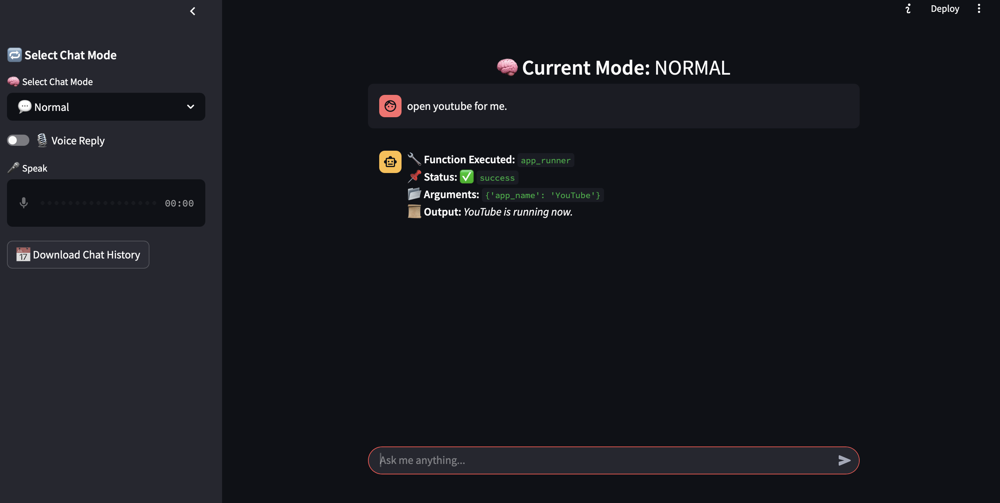

# 🚀 JARVIS 2.0

---
## J.A.R.V.I.S. 2.0 – Judgment Augmented Reasoning for Virtual Intelligent Systems
# 🤖 Jarvis AI Assistant

Welcome to the **Jarvis AI Assistant** project! 🎙️ This AI-powered assistant can perform various tasks such as **providing weather reports 🌦️, summarizing news 📰, sending emails 📧** , **CAG** , and more, all through **voice commands**. Below, you'll find detailed instructions on how to set up, use, and interact with this assistant. 🎧

---

## 🌟 Features

✅ **Voice Activation**: activate listening mode. 🎤\
✅ **Speech Recognition**: Recognizes and processes user commands via speech input. 🗣️\
✅ **AI Responses**: Provides responses using AI-generated **text-to-speech** output. 🎶\
✅ **Task Execution**: Handles multiple tasks, including:

- 📧 **Sending emails**
- 🌦️ **Summarizing weather reports**
- 📊 **Data Analysis using csv***
- 🧑🏻‍💻 **Pesonalize chat**
- 📰 **Reading news headlines**
- 🖼️ **Image generation**
- 🏦 **Database functions**
- 📱 **Phone call automation using ADB**
- 🤖 **AI-based task execution**
- 📡 **Automate websites & applications**
- 🏞️ **Image processing Using gemini** 
### "Image Source", ["Upload", "URL", "Camera"]
### "Select Action", ["Basic Detection", "Object Detection", "Segmentation","Resize"]
- 🧠 **Retrieval-Augmented Generation (RAG) for knowledge-based interactions on various topics**
- ✅ **Timeout Handling**: Automatically deactivates listening mode after **5 minutes** of inactivity. ⏳
- ✅ **Automatic Input Processing**: If no "stop" command is detected within **60 seconds**, input is finalized and sent to the AI model for processing. ⚙️
- ✅ **Multiple Function Calls**: Call **multiple functions simultaneously**, even if their inputs and outputs are unrelated. 🔄

---

## 📌 Prerequisites

Before running the project, ensure you have the following installed:

✅ **Python 3.9 or later** 🐍\
✅ Required libraries (listed in `requirements.txt`) 📜

### 🛠️ Configuration

1. **Create a ************`.env`************ file** in the root directory of the project.

2. **Add your API keys and other configuration variables** to the `.env` file:

```dotenv
  author_name="ganeshnikhil124@gmail.com"
  weather_link="https://rapidapi.com/weatherapi/api/weatherapi-com"
  news_link="https://newsapi.org"
  name="ganeshnikhil"
  Rag_model="granite3.1-dense:2b"
  Chat_model="granite3.1-dense:2b"
  Function_call_model="gemma3:4b"
  Text_to_info_model="gemma3:4b"
  Embedding_model="nomic-embed-text"
  genai_key=""
  Sender_email="ganeshnikhil124@gmail.com"
  Receiver_email=""
  Password_email=""
  Weather_api=""
  News_api=""
  Country="in"
  DEVICE_IP=""
  CSV_PATH="./DATA/business-employment-data-dec-2024-quarter.csv"
  UI="on"
  Yt_path="./DATA/youtube_video/"
```
2 . Install system requriements 

```install
bash ./intialize.sh

```

3. **Setup API Keys & Passwords** :

   - [🌩️ WEATHER API](https://rapidapi.com/weatherapi/api/weatherapi-com) - Get weather data.
   - [📰 NEWS API](https://newsapi.org) - Fetch latest news headlines.
   - [📧 GMAIL PASSWORD](https://myaccount.google.com/apppasswords) - Generate an app password for sending emails.
   - [🧠 OLLAMA](https://ollama.com) - Download models from Ollama (manual steup) .
     **install Models from ollama**
      ```
       ollama run gemma3:4b
       ollama run granite3.1-dense:2b
       ollama pull nomic-embed-text
      ```
   - [portaudio] - download portaudio to work with sound.
   - [🔮 GEMINI AI](https://ai.google.dev/) - API access for function execution.

## Model Details
  # Gemma for intellignet routing image and simple question answers.
```
  Model
    architecture        gemma3    
    parameters          4.3B      
    context length      8192      
    embedding length    2560      
    quantization        Q4_K_M    

  Parameters
    stop           "<end_of_turn>"    
    temperature    0.1                

  License
    Gemma Terms of Use                  
    Last modified: February 21, 2024
```
  # grantie dense has large context window ,for rag and chat.
```
  Model
    architecture        granite    
    parameters          2.5B       
    context length      131072     
    embedding length    2048       
    quantization        Q4_K_M     

  System
    Knowledge Cutoff Date: April 2024.    
    You are Granite, developed by IBM.    

  License
    Apache License               
    Version 2.0, January 2004
```
# gemini free teir for as fallback mechanism . (only for tool calling)
```
gemini-2.0-flash
   Audio, images, videos, and text	Text, images (experimental), and audio (coming soon)	Next generation features, speed, thinking, realtime streaming, and     multimodal generation
gemini-2.0-flash-lite
   Audio, images, videos, and text	Text	A Gemini 2.0 Flash model optimized for cost efficiency and low latency
gemini-2.0-pro-exp-02-05
   Audio, images, videos, and text	Text	Our most powerful Gemini 2.0 model
gemini-1.5-flash
   Audio, images, videos, and text	Text	Fast and versatile performance across a diverse variety of tasks
```

---------------------------------------------------------------------------------------------

## 💻 Installation

### 1️⃣ **Clone the Repository**

```bash
 git clone https://github.com/ganeshnikhil/J.A.R.V.I.S.2.0.git
 cd J.A.R.V.I.S.2.0
```

### 2️⃣ **Install Dependencies**

```bash
 pip install -r requirements.txt
```

---

## 🚀 Running the Application

### **Start the Program**

```bash
 streamlit run ui.py
```

---

## 🔄 **Function Calling Methods**

### 🔹 **Primary: Gemini AI-Based Function Execution**

🚀 Transitioned to **Gemini AI-powered function calling**, allowing multiple **function calls simultaneously** for better efficiency! ⚙️ If Gemini AI fails to generate function calls, the system automatically falls back to an **Ollama-based model** for reliable execution. 

🔹 **AI Model Used**: **Gemini AI** 🧠\
✅ Higher accuracy ✅ Structured data processing ✅ Reliable AI-driven interactions
---

## 📖 **RAG-Based Knowledge System**

💡 **Retrieval-Augmented Generation (RAG)** dynamically loads relevant markdown-based knowledge files based on the queried topic, **reducing hallucinations and improving response accuracy**.

---

## 📱 **ADB Integration for Phone Automation**

🔹 Integrated **Android Debug Bridge (ADB)** to enable **voice-controlled phone automation**! 🎙️

✅ **Make phone calls** ☎️\
✅ **Open apps & toggle settings** 📲\
✅ **Access phone data & remote operations** 🛠️

### **Setting Up ADB**

📌 **Windows**

```powershell
winget install --id=Google.AndroidSDKPlatformTools -e
```

📌 **Linux**

```bash
sudo apt install adb
```

📌 **Mac**

```bash
brew install android-platform-tools
```

---

## 🔮 **Future Enhancements**

✨ **Deeper mobile integration** 📱\
✨ **Advanced AI-driven automation** 🤖\
✨ **Improved NLP-based command execution** 🧠\
✨ **Multi-modal interactions (text + voice + image)** 🖼️

🚀 **Stay tuned for future updates!** 🔥

```markdown
## Gemini Model Comparison

The following table provides a comparison of various Gemini models with respect to their rate limits:

| Model                                      | RPM  |    TPM    |  RPD  |
|-------------------------------------       |-----:|----------:| -----:|
| **Gemini 2.0 Flash**                       |  15  | 1,000,000 | 1,500 |
| **Gemini 2.0 Flash-Lite Preview**          |  30  | 1,000,000 | 1,500 |
| **Gemini 2.0 Pro Experimental 02-05**      |   2  | 1,000,000 |   50  |
| **Gemini 2.0 Flash Thinking Experimental** |  10  | 4,000,000 | 1,500 |
| **Gemini 1.5 Flash**                       |  15  | 1,000,000 | 1,500 |
| **Gemini 1.5 Flash-8B**                    |  15  | 1,000,000 | 1,500 |
| **Gemini 1.5 Pro**                         |   2  |   32,000  |   50  |
| **Imagen 3**                               |  --  |    --     |  --   |
```

### Explanation:
- **RPM**: Requests per minute  
- **TPM**: Tokens per minute  
- **RPD**: Requests per day  

```
The focus of project is mostly on using small model and free (api)  models , get accurate agentic behaviours , to run these on low spec systems to.
```
